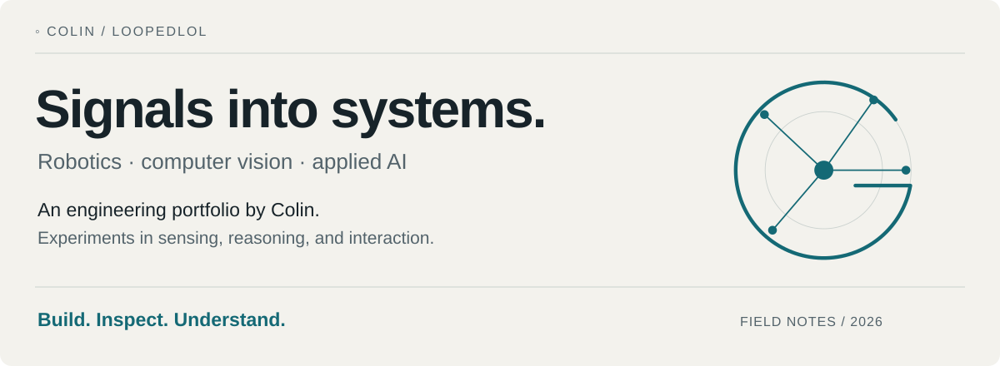
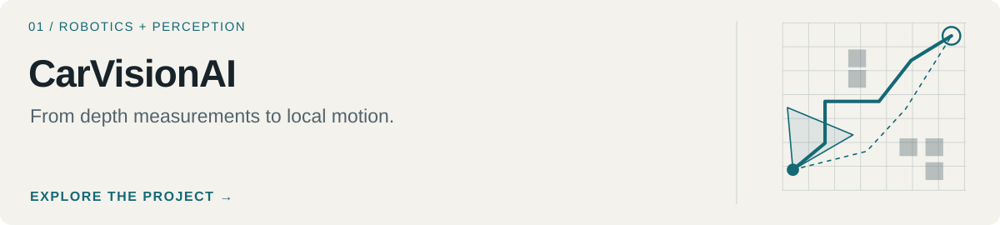
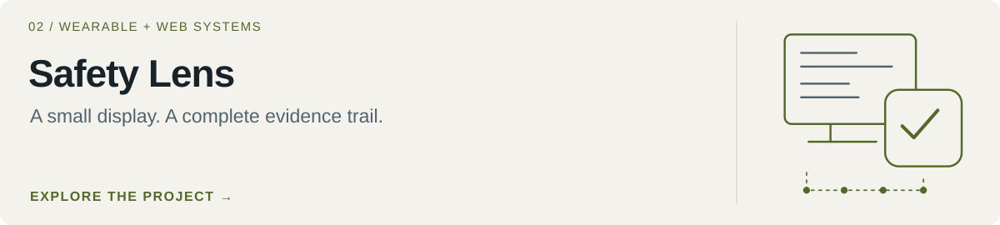
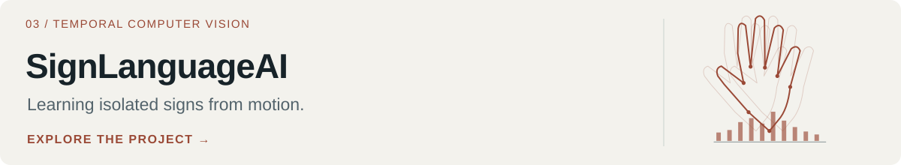
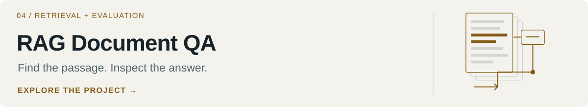

<picture>
  <source media="(prefers-color-scheme: dark)" srcset="docs/assets/portfolio/hero-dark.svg">
  
</picture>

[Selected work](#selected-work) · [How I approach projects](#approach) · [Explore by interest](#explore)

I'm Colin, a student exploring how perception, learning, and software fit together. I like figuring out why something works, building a small version, and looking closely at where it breaks.

My projects range from robot navigation and temporal vision to document retrieval and wearable workflows. The common thread is making the steps between an input and a useful result visible.

## Selected work

### Systems in depth

<a href="https://github.com/loopedlol/CarVisionAI">
  <picture>
    <source media="(prefers-color-scheme: dark)" srcset="docs/assets/portfolio/card-CarVisionAI-dark.svg">
    
  </picture>
</a>

**[CarVisionAI](https://github.com/loopedlol/CarVisionAI)** · Python / NumPy / OpenCV 
An autonomy development toolkit connecting depth geometry, occupancy maps, route planning, and simulated differential-drive control. Start with the visual active-perception walkthrough, then follow the module boundaries.

<a href="https://github.com/loopedlol/MetaSafetyWebApp">
  <picture>
    <source media="(prefers-color-scheme: dark)" srcset="docs/assets/portfolio/card-MetaSafetyWebApp-dark.svg">
    
  </picture>
</a>

**[Safety Lens](https://github.com/loopedlol/MetaSafetyWebApp)** · TypeScript / Express / SQLite 
A browser and smart-glasses workflow for toolbox meetings, evidence, and human review. The interesting engineering is in the boundaries: device capability, offline drafts, synchronization, and what counts as a confirmed record. A prototype with explicitly labeled mock AI.

### Focused experiments

<a href="https://github.com/loopedlol/SignLanguageAI">
  <picture>
    <source media="(prefers-color-scheme: dark)" srcset="docs/assets/portfolio/card-SignLanguageAI-dark.svg">
    
  </picture>
</a>

**[SignLanguageAI](https://github.com/loopedlol/SignLanguageAI)** · MediaPipe / PyTorch 
From webcam landmarks to a Temporal CNN for isolated signs. Includes recording, normalization, checkpoint evaluation, and live inference; no sentence-level translation claim.

<a href="https://github.com/loopedlol/RAGDocumentQA">
  <picture>
    <source media="(prefers-color-scheme: dark)" srcset="docs/assets/portfolio/card-RAGDocumentQA-dark.svg">
    
  </picture>
</a>

**[RAG Document QA](https://github.com/loopedlol/RAGDocumentQA)** · Chroma / multilingual embeddings / LLM evaluation 
A compact experiment with the retrieved passages saved beside every answer. The most useful part is being able to inspect a failure, not just read a score.

## How I approach projects

**Build a boundary.** Keep sensing, state, decisions, and presentation understandable as separate parts.

**Inspect the evidence.** Look at the intermediate representation, the saved output, and the failure case.

**Keep the claim small.** A simulated result, a working prototype, and a validated system mean different things.

## Explore by interest

| Follow this thread | Start here |
| --- | --- |
| Geometry, maps, and robot motion | [CarVisionAI](https://github.com/loopedlol/CarVisionAI#system) |
| Wearable interaction and offline state | [Safety Lens](https://github.com/loopedlol/MetaSafetyWebApp#system) |
| Motion as a sequence of features | [SignLanguageAI](https://github.com/loopedlol/SignLanguageAI#pipeline) |
| Retrieval, grounding, and evaluation | [RAG Document QA](https://github.com/loopedlol/RAGDocumentQA#results) |

Colin / loopedlol · Learning by building, testing ideas, and writing down what I find.
