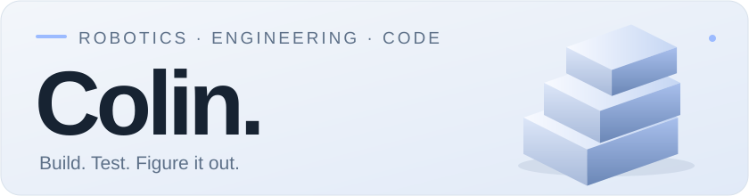
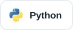
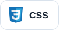
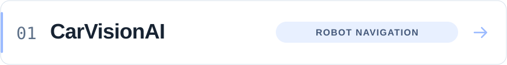
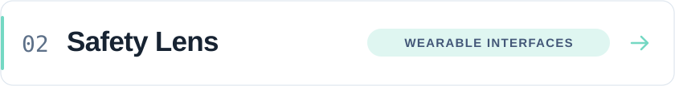
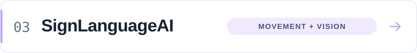
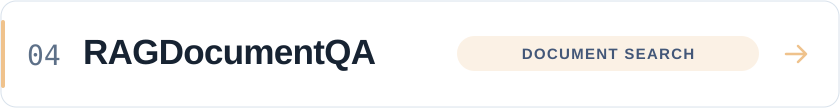
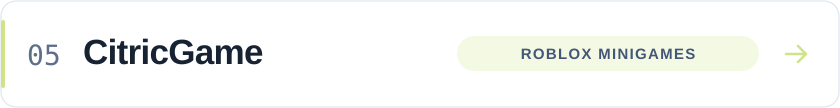

<picture>
  <source media="(prefers-color-scheme: dark)" srcset="docs/assets/profile/hero-dark.svg">
  
</picture>

I'm a high school senior interested in robotics and engineering. I like building something, testing the parts I thought I understood, and figuring out why they behave differently.

Most of my recent projects involve computer vision, robot navigation, or small AI experiments. Outside of projects, I run cross country and track and play violin.

### Languages I use

<picture>
  <source media="(prefers-color-scheme: dark)" srcset="docs/assets/profile/language-python-dark.svg">
  
</picture>
<picture>
  <source media="(prefers-color-scheme: dark)" srcset="docs/assets/profile/language-typescript-dark.svg">
  
</picture>
<picture>
  <source media="(prefers-color-scheme: dark)" srcset="docs/assets/profile/language-javascript-dark.svg">
  
</picture>
<picture>
  <source media="(prefers-color-scheme: dark)" srcset="docs/assets/profile/language-html-dark.svg">
  
</picture>
<picture>
  <source media="(prefers-color-scheme: dark)" srcset="docs/assets/profile/language-css-dark.svg">
  
</picture>

### Projects

<a href="https://github.com/loopedlol/CarVisionAI">
<picture>
  <source media="(prefers-color-scheme: dark)" srcset="docs/assets/profile/project-carvision-dark.svg">
  
</picture>
</a>

Camera-based mapping and navigation for my robot. I’ve tested the software on hardware; the included simulations let me compare routes and examine sensor noise.

<a href="https://github.com/loopedlol/MetaSafetyWebApp">
<picture>
  <source media="(prefers-color-scheme: dark)" srcset="docs/assets/profile/project-safety-lens-dark.svg">
  
</picture>
</a>

A workplace-hazard recording prototype with a browser dashboard, a simpler glasses interface, and offline drafts. Its AI suggestions are simulated.

<a href="https://github.com/loopedlol/SignLanguageAI">
<picture>
  <source media="(prefers-color-scheme: dark)" srcset="docs/assets/profile/project-sign-language-dark.svg">
  
</picture>
</a>

An ongoing experiment in recognizing individual Korean Sign Language signs from tracked movement. I’ve trained and tried a classifier locally.

<a href="https://github.com/loopedlol/RAGDocumentQA">
<picture>
  <source media="(prefers-color-scheme: dark)" srcset="docs/assets/profile/project-document-qa-dark.svg">
  
</picture>
</a>

Searching long Korean documents before generating answers, then examining the retrieved passages and mistakes.

<a href="https://github.com/loopedlol/CitricGame">
<picture>
  <source media="(prefers-color-scheme: dark)" srcset="docs/assets/profile/project-citric-dark.svg">
  
</picture>
</a>

A collaborative Roblox minigame project where I worked on gameplay programming and game design.

